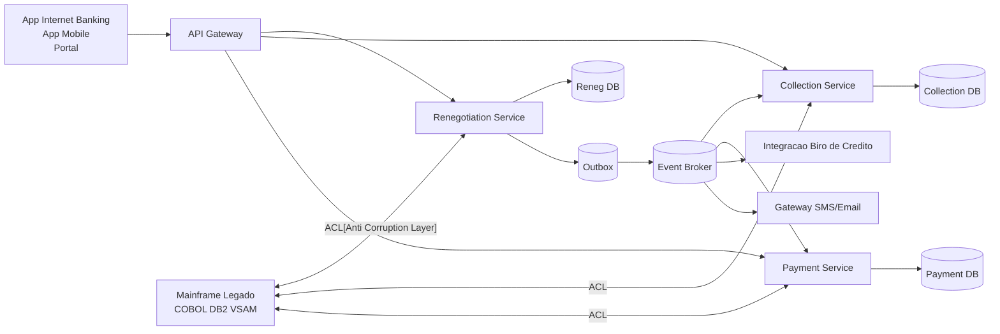

# Arquitetura Proposta

## Objetivo

Evoluir um legado monolitico de cobranca e renegociacao para uma arquitetura online, desacoplada e orientada a eventos.

## Visao de alto nivel

## Papel das pecas tecnicas

- API Gateway: roteamento, autenticacao e rate limiting
- Renegotiation Service: simulacao e efetivacao de acordos
- Collection Service: orquestracao de acoes de cobranca
- Payment Service: emissao de boleto e conciliacao de pagamentos
- Event Broker: integracao assincrona entre dominios
- Outbox: confiabilidade de publicacao de eventos
- Anti Corruption Layer: isolamento do legado e mapeamento de contratos

## Estrategia de modernizacao

1. Extracao inicial do fluxo de renegociacao com dados sincronizados ao legado
2. Introducao de eventos para integrar cobranca e pagamentos
3. Migracao gradual dos lotes para processamento orientado a eventos
4. Desativacao progressiva das funcoes equivalentes no monolito

## NFRs priorizados

- Latencia de simulacao inferior a 2 segundos
- Idempotencia nos comandos de efetivacao
- Resiliencia com retries, timeout e circuit breaker
- Observabilidade com metricas, logs estruturados e tracing
